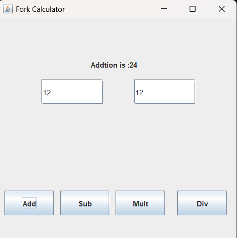

# 🧮 Fork Calculator - Java Swing GUI Application

A basic calculator desktop application built using Java Swing GUI. This project allows users to perform simple arithmetic operations like Addition, Subtraction, Multiplication, and Division with a clean graphical interface.

---

## 📸 Screenshot

## Screenshot

---

## 🛠️ Features

- GUI made with Java Swing
- Addition, Subtraction, Multiplication, Division
- Real-time input through text fields
- Button-based operations
- Result shown on the same window

---

